# Android签名配置指南

## 为什么需要签名？

Android系统要求所有APK必须经过数字签名才能安装。本地编译时使用本地的`app/keystore.jks`文件，但GitHub Actions CI环境无法访问本地文件，需要通过GitHub Secrets安全传递签名密钥。

---

## 🔐 配置GitHub Secrets

### 第一步：准备keystore的Base64编码

已生成文件：`app/keystore.jks.base64`（3337字节）

### 第二步：在GitHub仓库配置Secrets

1. **打开GitHub仓库设置**
   ```
   https://github.com/puck02/HEl/settings/secrets/actions
   ```

2. **添加以下4个Secrets**（点击"New repository secret"）：

   | Secret名称 | 值 | 说明 |
   |-----------|---|------|
   | `KEYSTORE_FILE` | 粘贴`app/keystore.jks.base64`文件的完整内容 | base64编码的密钥库文件 |
   | `KEYSTORE_PASSWORD` | `heldairy2024` | 密钥库密码 |
   | `KEY_ALIAS` | `heldairy` | 密钥别名 |
   | `KEY_PASSWORD` | `heldairy2024` | 密钥密码 |

### 第三步：验证配置

1. **删除本地base64文件**（安全考虑）：
   ```bash
   rm app/keystore.jks.base64
   ```

2. **提交签名配置变更**：
   ```bash
   git add .github/workflows/build-release.yml app/build.gradle.kts
   git commit -m "feat(ci): 配置GitHub Actions签名支持"
   git push
   ```

3. **触发签名构建**：
   ```bash
   # 删除旧tag并重新创建
   git tag -d v1.0.0-kitty
   git push origin :refs/tags/v1.0.0-kitty
   
   # 重新打tag触发CI
   git tag v1.0.0-kitty
   git push origin v1.0.0-kitty
   ```

4. **验证签名APK**：
   - 打开 https://github.com/puck02/HEl/actions
   - 等待构建完成（约3-5分钟）
   - 下载Release APK
   - 在Android设备上安装测试

---

## 🔍 签名验证命令

下载APK后，可通过以下命令验证签名：

```bash
# 查看APK签名信息
apksigner verify --print-certs heldairy-v1.0.0-kitty-release.apk

# 或使用keytool
unzip -p heldairy-v1.0.0-kitty-release.apk META-INF/CERT.RSA | keytool -printcert
```

**期望输出**：
```
Signer #1 certificate DN: CN=HElDairy, OU=Android, O=HElDairy, L=Beijing, ST=Beijing, C=CN
Signer #1 certificate SHA-256 digest: [SHA-256哈希值]
Verified using v1 scheme (JAR signing): true
Verified using v2 scheme (APK Signature Scheme v2): true
Verified using v3 scheme (APK Signature Scheme v3): true
```

---

## 🛠️ 本地编译签名版本

本地开发不需要配置环境变量，直接使用`app/keystore.jks`：

```bash
./gradlew assembleRelease
```

生成的APK位置：
```
app/build/outputs/apk/release/app-release.apk
```

---

## 🔒 安全注意事项

1. **不要提交密钥文件到Git**
   - `app/keystore.jks` 已在`.gitignore`中
   - `app/keystore.jks.base64` 用完即删

2. **密钥泄露应对**
   - 如果keystore泄露，立即生成新密钥
   - 更新GitHub Secrets中的`KEYSTORE_FILE`
   - 重新签名发布所有版本

3. **生产环境建议**
   - 定期轮换密钥密码
   - 使用更强的密码（当前密码偏弱）
   - 考虑使用Google Play App Signing托管密钥

---

## 📝 签名工作流程说明

### CI环境（GitHub Actions）


### 本地环境

```mermaid
graph LR
A[执行assembleRelease] --> B[Gradle检测本地keystore.jks]
B --> C[使用默认密码]
C --> D[生成签名APK]
```



---

## ❓ 常见问题

**Q: 为什么CI构建失败，提示"keystore not found"？**
A: GitHub Secrets未配置或`KEYSTORE_FILE`内容有误，检查是否完整粘贴base64内容。

**Q: 签名后APK能在不同设备上安装吗？**
A: 可以。同一个keystore签名的APK可以在所有Android设备上安装（需满足minSdk要求）。

**Q: 如何生成新的keystore？**
```bash
keytool -genkey -v -keystore app/keystore.jks \
  -alias heldairy \
  -keyalg RSA -keysize 2048 \
  -validity 10000
```

**Q: 本地编译的APK和CI编译的APK签名相同吗？**
A: 是的，只要使用同一个keystore文件，签名完全相同（SHA-256哈希一致）。

---

## 📂 相关文件

- `app/build.gradle.kts` - Gradle签名配置
- `.github/workflows/build-release.yml` - CI签名流程
- `app/keystore.jks` - 本地签名密钥（不提交）
- `app/keystore.jks.base64` - Base64编码（临时文件，用完即删）

---

## ✅ 配置完成检查清单

- [ ] GitHub Secrets已配置（4个）
- [ ] 已删除`app/keystore.jks.base64`
- [ ] 已提交workflow和build.gradle.kts变更
- [ ] 已推送tag触发CI构建
- [ ] 下载Release APK并验证签名
- [ ] 在真机上测试安装
